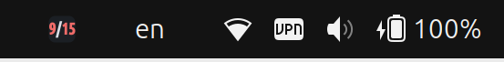
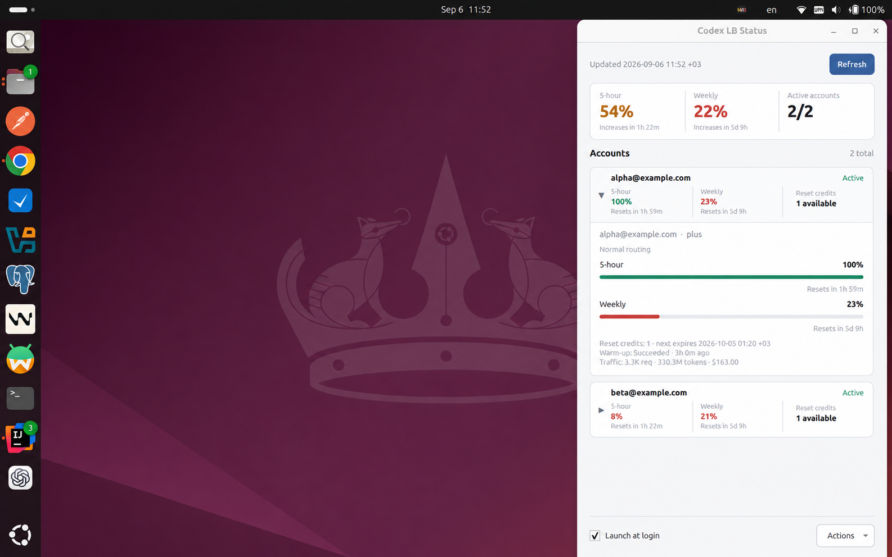

# Codex LB Status

A read-only Ubuntu tray monitor for [Codex LB](https://github.com/Soju06/codex-lb).
It shows pooled quota, account health, reset credits, and update state without
requiring the Codex LB dashboard to remain open.

[Download the latest release](https://github.com/VictorStatko/codex-lb-status/releases/latest)
· [Report a problem](https://github.com/VictorStatko/codex-lb-status/issues)

> [!IMPORTANT]
> Codex LB Status is an independent companion, not an official Codex LB
> component. It cannot create, edit, pause, reactivate, import, export, or
> delete accounts, and it cannot change routing, quota, server, or dashboard
> settings.

## Features

- Compact tray indicator with pooled 5-hour and weekly quota as `5h/weekly`.
- Read-only account list with status, quota windows, reset times, reset credits,
  routing policy, warm-up state, and available traffic totals.
- Automatic refresh every 60 seconds, manual refresh, and preservation of the
  last successful snapshot during temporary failures.
- Support for authentication-disabled dashboards, administrator password and
  TOTP, guest access, and transparent trusted-header authentication.
- Per-server sessions, local or UTC timestamps, launch at login, and
  single-instance behavior.
- Native Qt 6 interface with keyboard navigation and text equivalents for
  color-coded quota state.

## Screenshot





## Requirements

- A running Codex LB dashboard reachable from the desktop.
- Fully updated Ubuntu 24.04 LTS or 26.04 LTS.
- A system-tray host. Ubuntu GNOME normally provides one through its
  AppIndicator extension; KDE Plasma and Xfce provide one through their tray
  widgets.
- HTTPS for a remote Codex LB server. Plain HTTP is accepted only for
  `localhost`, `127.0.0.1`, and `::1`.

The Debian package is `Architecture: all` and is tested on amd64 and arm64. It
uses Ubuntu's Python 3, PyQt6, and Qt 6 packages. If APT cannot find
`python3-pyqt6`, enable the Ubuntu Universe repository first. The GNOME
AppIndicator extension is suggested for compatibility, not installed as a
required dependency.

## Compatibility

The released Debian package is tested on every platform marked below:

| Operating system | amd64 | arm64 | Support level |
| --- | --- | --- | --- |
| Ubuntu 24.04 LTS | CI-tested | CI-tested | Supported |
| Ubuntu 26.04 LTS | CI-tested | CI-tested | Supported |
| Other Ubuntu or Debian-derived releases | Not tested | Not tested | Not currently supported |

The package requires Python 3.12 or newer, PyQt6 6.6 or newer, and Qt 6.4 or
newer. APT checks these runtime requirements during installation.

| Codex LB Status | Codex LB server | Compatibility |
| --- | --- | --- |
| Current `0.1.x` release line | `1.25.0-beta.1` at [`dd28d7d`](https://github.com/Soju06/codex-lb/commit/dd28d7dff94cdd4919067c1986fd9606b9bbc6b9) | Dashboard and authentication API contract verified |
| `0.1.37` | `1.25.0-beta.9` | Session permission schema verified against a running server; account schema checked against release source; refresh and sign-in flows regression-tested |

These are verified baselines. Additive API changes are tolerated: unknown fields
are ignored at every nesting level, new permission names and scopes are retained,
and new account status, routing, role, and authentication-mode labels do not
invalidate a refresh. Repeated permissions are deduplicated. Unknown account
statuses are displayed, counted in the total, and excluded from active counts
and pooled quota until their meaning is supported.

The client still validates the structure and types of fields it reads, including
authentication booleans, account identifiers, timestamps, and quota values.
Missing required fields or invalid data produce an invalid-response error.

Codex LB `1.25.0-beta.9` adds scoped permissions such as `accounts:read:all`
alongside the existing `read` and `write` aliases. The client accepts both
formats. If the server update expires a saved dashboard session, sign in again
from Details. Password-only sign-in is supported when the server does not
require a username (single-user installations).

## Install

Download the `.deb` for the latest release from the
[Releases page](https://github.com/VictorStatko/codex-lb-status/releases). A
matching `.sha256` file is published with each package; to verify the download,
run `sha256sum` on the `.deb` and compare the result with that file.

Install the package with APT, replacing `VERSION` with the downloaded version:

```bash
sudo apt install ./codex-lb-status_VERSION_all.deb
```

APT installs all runtime dependencies; no pip or manual Qt setup is required.
You can also open the downloaded `.deb` in Ubuntu App Center and select
**Install**.

The package installs the application, launcher, desktop entry, icon, AppStream
metadata, and documentation under standard system paths. Installation does not
write to the current user's home directory, start the application, or enable it
at login. After installation, start **Codex LB Status** manually from the
application menu or by running `codex-lb-status`. You can then enable **Launch
at login** in the application's Settings.

### Update

There is no automatic updater, and APT does not restart a running indicator.
Stop it with **Actions → Stop indicator**, download and verify the newer `.deb`
from the [Releases page](https://github.com/VictorStatko/codex-lb-status/releases),
then install it over the existing package:

```bash
sudo apt install ./codex-lb-status_NEW_VERSION_all.deb
codex-lb-status --version
```

After installation, start **Codex LB Status** again from the application menu,
or run `codex-lb-status --background` to restart it with only the tray indicator
visible.

If you install the package without stopping the indicator first, the running
process continues to use the old version. Stop that process from **Actions →
Stop indicator**, then start the application again. Running
`codex-lb-status --version` shows the version installed on disk; it does not
confirm which version an existing indicator process is running.

You do not need to uninstall the old version first. APT preserves the existing
preferences, saved sessions, and launch-at-login setting.

## Start and stop

Start **Codex LB Status** from the application menu or use one of these commands:

| Command | Result |
| --- | --- |
| `codex-lb-status` | Start the indicator and open Details. |
| `codex-lb-status --background` | Start with only the tray indicator visible. |
| `codex-lb-status --settings` | Start the indicator and open Settings. |
| `codex-lb-status --version` | Print the installed version. |
| `codex-lb-status --help` | Show all command-line options. |

Only one instance runs per user session. Running the default command or
`--settings` again brings the existing window forward instead of creating
another tray icon.

Closing Details leaves the indicator running when a tray host is available.
Use **Actions → Stop indicator** to exit. Without a tray host, closing Details
exits the application.

## Use the indicator

When either main quota window is available, a value such as `82/47` means 82%
of the pooled 5-hour quota and 47% of the pooled weekly quota remain. A dash
means that Codex LB did not report that window. If both are unavailable, the
tray uses a color-only status icon.

Each value is colored independently:

| Remaining quota | Color |
| --- | --- |
| 70–100% | Green |
| 30–69% | Amber |
| Below 30% | Red |
| Unavailable | Gray |

For current Codex LB responses, pooled percentages are weighted by each
routing-eligible account's capacity. For older responses without credit
capacity fields, the application uses the mean of the reported percentages.
Accounts with `active`, `quota_exceeded`, `rate_limited`, or `reauth_required`
status participate when they provide usable quota data.

Double-click the indicator to toggle Details. The indicator intentionally has
no context menu or tooltip; all status and actions are in the Details window.

If a refresh fails, the last successful numbers remain visible. After the data
has been out of date for five minutes, the numbers are replaced by an amber
warning icon until a refresh succeeds.

## Use Details

Details shows pooled quota, the nearest time each pooled quota will increase,
active and total account counts, the last successful update time, and one
collapsed row per account. Expand a row to inspect all quota windows and reset
times, routing policy, reset-credit expiry, warm-up state, and traffic totals
supplied by Codex LB.

Available controls are:

- **Refresh** — fetch account state immediately. Overlapping refreshes are
  ignored, and network work never blocks the Qt interface.
- **Launch at login** — start the tray indicator after signing in to the
  desktop.
- **Actions → Settings** — configure the server and timestamp display.
- **Actions → Open dashboard** — open the configured Codex LB origin in the
  default browser.
- **Actions → Sign out** — remove the saved session for the current server from
  this application only.
- **Actions → Stop indicator** — exit Codex LB Status.

When authentication is required, cached quota and account rows are hidden until
sign-in succeeds. A stale banner means the displayed rows are the last
successful snapshot, not newly fetched data.

## Configure

The default Codex LB origin is `http://127.0.0.1:2455`. Open **Settings** to
change:

- **Server address** — an HTTP or HTTPS origin;
- **Display time** — system local time or UTC; and
- **Launch at login**.

The server address must not contain credentials, a path, query parameters, or a
fragment. Remote addresses must use HTTPS. Changing the server selects that
origin's separate cookie store and starts a refresh only after all settings
have been saved successfully. Changing only the display time updates the
existing snapshot without a network request.

**Restore defaults** fills in the loopback origin, local time, and disabled
autostart. Select **Save changes** to apply them. Restoring defaults does not
delete saved sessions.

Normal use does not require editing application files. The application follows
the XDG base-directory environment variables and otherwise uses these paths:

| Data | Default path |
| --- | --- |
| Preferences | `~/.config/codex-lb-status/config.json` |
| Per-origin session cookies | `~/.local/state/codex-lb-status/sessions/` |
| Diagnostic log | `~/.local/state/codex-lb-status/codex-lb-status.log` |
| Launch-at-login entry | `~/.config/autostart/io.github.victorstatko.codex_lb_status.desktop` |

Preferences and cookies are written atomically with user-only permissions.

## Authentication

Codex LB Status uses the authentication methods advertised by the configured
Codex LB server; there is no authentication mode to select locally.

| Codex LB configuration | Application behavior |
| --- | --- |
| Authentication disabled | Loads account state without a prompt. |
| Administrator password | Shows **Sign in** and requests the dashboard administrator password. |
| Administrator password with TOTP | Requests the password, then opens a separate six-digit verification dialog. |
| Password-protected guest access | Shows **Continue as guest** and requests the guest password. |
| Passwordless guest access | Uses the server's passwordless flow; an empty guest-password submission is supported when prompted. |
| Trusted-header authentication | Works when the reverse proxy injects the configured trusted-user header into this native client's requests. |

Sign-in choices appear only when the server advertises them. Trusted-header
authentication must be transparent: the application does not open an
interactive browser or implement an SSO handoff.

Passwords and TOTP codes remain in memory only while their request is running.
For TOTP sign-in, the intermediate administrator cookie is not saved until the
code succeeds. **Sign out** deletes only the current origin's local cookie; it
does not call a server logout endpoint or affect browser sessions.

## Read-only and privacy guarantees

The built-in client can make only these requests to the configured origin:

```text
GET  /api/dashboard-auth/session
GET  /api/accounts
POST /api/dashboard-auth/password/login
POST /api/dashboard-auth/guest/login
POST /api/dashboard-auth/totp/verify
```

The GET requests read dashboard state. The POST requests only establish or
verify a dashboard session. No account, routing, quota, import/export, reset,
logout, credential-management, or server-settings endpoint is implemented.

The application sends no analytics or remote telemetry. It stores cookies
separately for each origin, discards expired or cross-origin cookies, rejects
HTTP redirects, validates TLS certificates through the system trust store, and
limits response size. A small, rotating local diagnostic log records request
paths, status codes, timing, authentication state, and safe error codes to help
investigate intermittent failures. Passwords, TOTP codes, cookie values,
response bodies, and authentication error text are not persisted. Server-
provided labels are rendered as bounded plain text.

## Troubleshooting

| Symptom | What to check |
| --- | --- |
| **Could not load account status** | Confirm that Codex LB is running, verify the server address in Settings, then select **Refresh**. Requests time out after 10 seconds. |
| **Last update failed** | The application is showing the last successful snapshot. Restore connectivity or authentication and refresh again. |
| **Signed out unexpectedly** | After it happens, save `~/.local/state/codex-lb-status/codex-lb-status.log` and the Codex LB server logs. The local log distinguishes session expiry, HTTP 401 responses, network failures, and local cookie-state problems. Never attach the cookie files. |
| No tray icon | On GNOME, enable an AppIndicator/StatusNotifierItem extension. On KDE or Xfce, enable the desktop's system-tray widget. A foreground launch remains usable without a tray. |
| Remote server fails over HTTPS | Verify the hostname and certificate chain. The certificate must be trusted by Ubuntu's system CA store. |
| Trusted-header login does not work | Confirm that the reverse proxy injects its trusted-user header for requests from this native client, not only for browser sessions. |

On Wayland with XWayland available, the launcher selects Qt's XCB backend so
tray-owned windows can be placed predictably. An explicitly set
`QT_QPA_PLATFORM` is always preserved.

When reporting a problem, include the output of `codex-lb-status --version`, the
Codex LB version, Ubuntu version, desktop environment, session type (Wayland or
X11), and the exact in-app error. Never attach cookie files or credentials.

## Remove

First exit the running application with **Actions → Stop indicator**. Then
remove the system package and every file Codex LB Status created for the current
desktop user:

```bash
sudo apt purge codex-lb-status

codex_config_home="${XDG_CONFIG_HOME:-$HOME/.config}"
codex_state_home="${XDG_STATE_HOME:-$HOME/.local/state}"

rm -f -- \
  "$codex_config_home/autostart/io.github.victorstatko.codex_lb_status.desktop"
rm -rf -- \
  "$codex_config_home/codex-lb-status" \
  "$codex_state_home/codex-lb-status"
```

The `rm` commands permanently delete all preferences and saved dashboard
sessions, so omit them if you may reinstall the application and want to keep
that data. Run them as the desktop user, not with `sudo`. If more than one
operating-system user ran Codex LB Status, repeat the user-data cleanup while
signed in as each of those users.

Codex LB Status creates no cache, database, or system service. It does create
the bounded local diagnostic log described above. The cleanup above does not
change the Codex LB server, server-side sessions, or browser data. A downloaded
`.deb` or a source checkout is not managed by APT and can be deleted separately
if it is no longer wanted.

## Development

The source requires Python 3.12 or newer, PyQt6 6.6 or newer, and Qt 6.4 or
newer. The application has no runtime PyPI dependencies; its Qt runtime comes
from Ubuntu.

Install the system dependencies:

```bash
sudo apt update
sudo apt install \
  python3 python3-venv python3-pyqt6 \
  qt6-qpa-plugins qt6-wayland \
  dbus-x11 xvfb
```

Clone the repository and create a development environment:

```bash
git clone https://github.com/VictorStatko/codex-lb-status.git
cd codex-lb-status
python3 -m venv --system-site-packages .venv
source .venv/bin/activate
python -m pip install uv -e '.[dev]'
```

`--system-site-packages` exposes Ubuntu's PyQt6 installation inside the virtual
environment. Development-only Python packages remain isolated in `.venv`.

Run from source with:

```bash
python -m codex_lb_status
```

### Tests and linting

Run the same standard checks used by CI:

```bash
make check
```

Run the Qt UI suite with X11 and D-Bus services:

```bash
make test-ui
```

`make check` compiles the source, verifies `uv.lock`, checks linting and
formatting, and runs the configured coverage gate with warnings treated as
errors.

Tests do not require a live Codex LB server. HTTP integration tests use a local
fake server and assert the exact request allowlist.

### Project layout

| Path | Responsibility |
| --- | --- |
| `src/codex_lb_status/client.py` | Bounded dashboard HTTP client and authentication flow. |
| `src/codex_lb_status/models.py` | Strict decoding of dashboard responses and application state. |
| `src/codex_lb_status/config.py` | URL validation, XDG paths, and atomic settings transactions. |
| `src/codex_lb_status/sessions.py` | Origin-scoped cookie persistence. |
| `src/codex_lb_status/refresh.py` | Single-worker background refresh coordination. |
| `src/codex_lb_status/indicator.py` | Tray-host detection, activation, and quota icon rendering. |
| `src/codex_lb_status/ui.py` | Details, Settings, and authentication dialogs. |
| `src/codex_lb_status/app.py` | CLI entry point and application lifecycle. |
| `tests/` | Unit, integration, UI, security, and read-only contract tests. |
| `debian/` | Debian package metadata and filesystem layout. |

### Build the Debian package

Install packaging tools and build the architecture-independent package:

```bash
sudo apt install debhelper-compat dh-python python3-all lintian
make package
```

The build itself does not need network access after the Ubuntu build
dependencies are installed.

### Release checklist

Prepare the release metadata with one command:

```bash
make prepare-release VERSION=0.1.37
```

Review the generated Debian changelog and AppStream descriptions, run
`make check`, and commit the changes through the normal pull-request process.
After that commit reaches `main`, create and push the matching tag:

```bash
git tag v0.1.37
git push origin v0.1.37
```

The tag runs the complete CI pipeline. It validates every version location,
builds the `.deb` once, and installs that exact package in clean Ubuntu 24.04
and 26.04 containers on amd64 and arm64. Only after every check succeeds does
the final job publish the tested `.deb`, its SHA-256 checksum, and generated
release notes to GitHub Releases.

## License and attribution

Codex LB Status is maintained by
[Victor Statko](mailto:statkovit@gmail.com) and distributed under the terms in
[LICENSE](LICENSE).

Contributions are welcome; see [CONTRIBUTING.md](CONTRIBUTING.md). Please report
security issues privately as described in [SECURITY.md](SECURITY.md).
